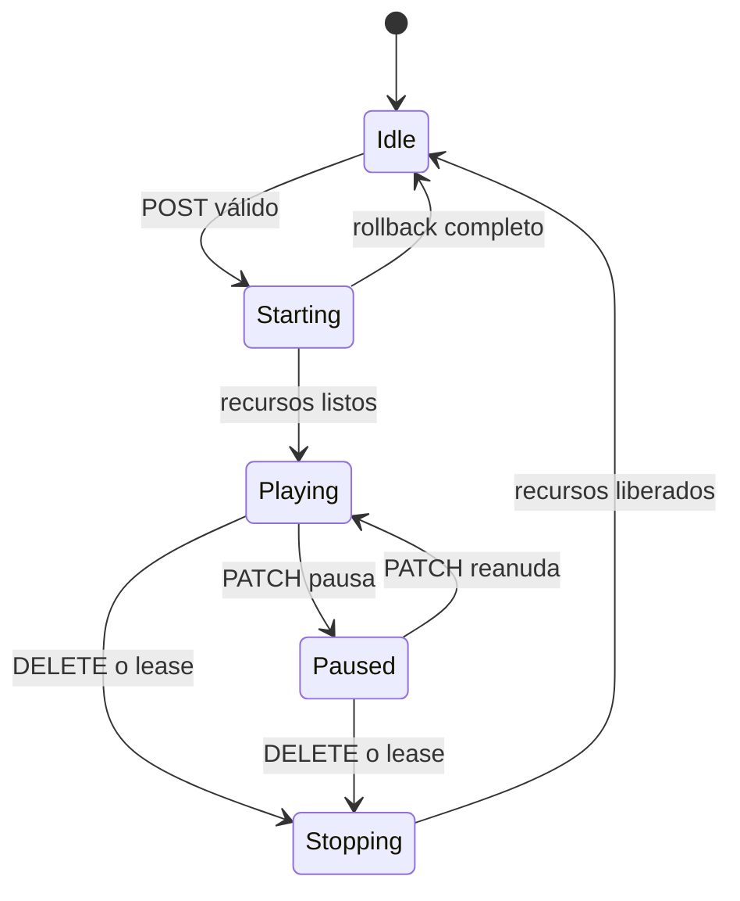

# Arquitectura del ecosistema Michi

## Diagrama de alto nivel

```
┌─────────────────────────────────────────────────────────────────────┐
│                        ECOSISTEMA MICHI                              │
├─────────────────────────────────────────────────────────────────────┤
│                                                                      │
│   michi-link (este repo)                                             │
│   Contrato + implementación de referencia                            │
│   schemas/ · openapi/ · contracts/ · crates/michi-identity           │
│                                                                      │
│        ┌──────────────────────┐        ┌───────────────────────────┐ │
│        │  michi-music-player  │◄──────►│     michi-music-mobile    │ │
│        │  (escritorio, Linux) │        │  (Android, app móvil)     │ │
│        └──────────┬───────────┘        └───────────┬───────────────┘ │
│                   │                                │                 │
│                   │      ┌──────────────────┐      │                 │
│                   └─────►│ michi-micro-server│◄────┘                 │
│                          │  (servidor hogar) │                       │
│                          └────────┬─────────┘                       │
│                                   │  API v1-lite (HTTP) + RTP/UDP   │
│                                   ▼                                  │
│                          ┌──────────────────┐                       │
│                          │michi-music-stream │                       │
│                          │ (receptor físico  │                       │
│                          │  Standard / Hi-Fi)│                       │
│                          └──────────────────┘                       │
│                                                                      │
│         ◄───────── Descubrimiento mDNS / UDP firmado ───────────►    │
│         ◄───────── HTTP REST /api/v1 · WebSocket eventos ───────►    │
│         ◄───────── Sesión RTP/UDP PCM (solo receptores) ────────►    │
│                                                                      │
└─────────────────────────────────────────────────────────────────────┘
```

---

## Los proyectos del ecosistema

Este repositorio (`michi-link`) define el contrato; los demás repositorios lo consumen. No existen otros proyectos.

### 1. `michi-link` — el contrato

**Rol:** fuente normativa única del protocolo. No es una aplicación: define el wire format que cualquier componente puede hablar.

**Contenido:**
- `schemas/` — JSON Schemas (draft-07) canónicos, incluidos los del perfil receiver v1-lite.
- `openapi/michi-link-v1.yaml` — superficie HTTP canónica.
- `contracts/receiver-v1-lite/` — bundle versionado e inmutable (OpenAPI, schemas, ejemplos, vectores, manifest SHA-256). Es la única entrada contractual para receptores.
- `crates/michi-identity/` — implementación de referencia de identidad, pairing, discovery y QR (Rust).
- `tests/contract`, `tests/identity_contract`, `tests/cross_layer` — suites de conformidad.

**Tecnologías:** JSON Schema, OpenAPI 3.0, Rust.

---

### 2. `michi-music-player`

**Rol:** reproductor de escritorio para Linux. Centro maestro de gestión de biblioteca, metadatos, carátulas, letras, playlists y sincronización.

**Responsabilidades:**
- Servir la API v1 (`api_version: "v1"`): biblioteca, streaming HTTP Range, playback, cola, sync, import.
- Autenticación `PLAYER_PASSWORD` con `token_refresh: false`.
- Roles: `desktop_player`, `library_master`, `sync_host`.

**Tecnologías:** Python, PySide6, GStreamer.

---

### 3. `michi-micro-server`

**Rol:** servidor hogareño liviano. Recibe la biblioteca desde Player, la respalda, la sirve a Mobile y distribuye audio en la casa.

**Responsabilidades:**
- Servir la API v1 (`api_version: "v1"`): biblioteca, descargas, sync, playback, cola, import.
- Autenticación `SERVER_CODE` con `token_refresh: true`.
- Roles: `music_server`, `library_host`, `playback_host`.
- Consumir receptores v1-lite: discovery, pairing (`device_type: "server"`), creación de sesión RTP/UDP, heartbeat, control de volumen/pausa vía la superficie canónica de receiver-lite. La gestión server-side de receptores usa `GET /api/v1/receivers` y `POST /api/v1/receivers/discover`.

**Tecnologías:** Rust, Tokio, Axum, SQLite.

---

### 4. `michi-music-mobile`

**Rol:** app Android. Reproducción local/offline, descarga/stream desde Micro Server y control remoto del ecosistema.

**Responsabilidades:**
- Consumir la API v1 de Player y Micro Server.
- Discovery canónico (mDNS / UDP firmado), pairing como iniciador, validación de `api_version`.
- Roles: `mobile_player`, `remote_controller`, `sync_client`.

**Tecnologías:** Kotlin, Jetpack Compose, Media3.

---

### 5. `michi-music-stream`

**Rol:** familia de receptores de audio físicos. Solo recibe audio y lo convierte a salida física. No tiene biblioteca, playlists ni reproducción autónoma.

**Responsabilidades:**
- Implementar el perfil receiver v1-lite congelado (`api_version: "v1-lite"`, `service` `michi-stream-standard` o `michi-stream-hifi`, `roles: ["audio_receiver"]`).
- Identidad persistente Ed25519; pairing `RECEIVER_BUTTON` con ventana física de 120 s; tokens emitidos por el receptor.
- Una única sesión RTP/UDP PCM (48 kHz, 16-bit, estéreo, 10 ms, PT 97) con lease renovado por heartbeat cada 10 s.
- Variantes: **Standard** (jack 3.5mm) y **Hi-Fi** (DAC, RCA). Ambas anuncian inicialmente el mismo audio certificado.

**Tecnologías:** firmware C (ESP-IDF), simulador Python para pruebas de contrato.

---

## Modelo de identidad de dispositivo

Cada dispositivo expone su identidad en `GET /api/v1/server/info`:

```json
{
  "service": "michi-stream-standard",
  "name": "Michi Stream Cocina",
  "server_id": "550e8400-e29b-41d4-a716-446655440000",
  "version": "0.3.0",
  "api_version": "v1-lite",
  "roles": ["audio_receiver"],
  "identity_scheme": "ed25519-blake3-v1",
  "michi_id": "QlGQosQszLQse057MCaw32IAHXv-I5klmAAsbivIays",
  "public_key": "KJN5aOu4gWhA0clmvmwqprYcwYI013vDNPx1jf90CpQ",
  "auth": { "required": true, "strategy": "RECEIVER_BUTTON", "token_refresh": false },
  "features": { "session": true, "heartbeat": true, "volume": true, "now_playing": true, "diagnostics": true, "ota": true },
  "audio": {
    "transports": ["rtp_udp"], "codecs": ["pcm_s16le"], "sample_rates": [48000],
    "bit_depths": [16], "channels": [2], "packet_ms": [10], "payload_types": [97],
    "buffer_ms_min": 50, "buffer_ms_max": 500
  }
}
```

### Campos

| Campo | Tipo | Descripción |
|-------|------|-------------|
| `service` | enum | `michi-music-player`, `michi-micro-server`, `michi-mobile`, `michi-stream-standard` o `michi-stream-hifi`. |
| `name` | string | Nombre legible configurado por el usuario. |
| `server_id` | UUID v4 | Identificador estable, generado una vez y persistido (NVS en receptores). |
| `version` | string | Versión de la aplicación; en receptores, la versión de firmware. |
| `api_version` | enum | `v1` (servidores completos) o `v1-lite` (receptores). No es semver. |
| `roles` | string[] | Roles activos, del enum canónico (ver abajo). |
| `identity_scheme` | string | `ed25519-blake3-v1`. Obligatorio junto con `michi_id` y `public_key` para `michi-stream-*` (todo o nada). |
| `michi_id` | string | Derivado de `public_key` (BLAKE3, base64url, 43 chars). Nunca igual a `server_id`. |
| `auth` | object | `required`, `strategy`, `token_refresh`. |
| `features` | object | Flags booleanos; una feature vale `true` solo si su handler está registrado y tiene prueba positiva. |
| `audio` | object | Capacidad reproducible real, no la capacidad teórica del DAC. |

---

## Roles

| Rol | Descripción |
|-----|-------------|
| `desktop_player` | Reproductor de escritorio (Player). |
| `library_master` | Dueño de la biblioteca canónica (Player). |
| `sync_host` | Anfitrión de sincronización (Player). |
| `music_server` | Servidor de música (Micro Server). |
| `library_host` | Anfitrión de biblioteca (Micro Server). |
| `playback_host` | Anfitrión de reproducción (Micro Server). |
| `mobile_player` | Reproductor móvil (Mobile). |
| `remote_controller` | Control remoto del ecosistema (Mobile). |
| `sync_client` | Cliente de sincronización offline (Mobile). |
| `audio_receiver` | Receptor de audio v1-lite (Stream); exactamente este único rol. |

---

## Permisos

Los permisos se otorgan durante el pairing y cada endpoint declara el que exige. Lista completa en [docs/PERMISSIONS.md](PERMISSIONS.md).

Permisos mínimos emitidos por un receptor v1-lite tras el pairing (fijados por ADR-0001):

| Permiso | Descripción |
|---------|-------------|
| `receiver.status` | Consultar estado del receptor. |
| `receiver.session` | Crear y gestionar la sesión de audio. |
| `receiver.volume` | Controlar volumen y pausa. |
| `receiver.now_playing` | Publicar metadatos now-playing (extensión opcional). |

`receiver.ota` **no** se concede por defecto.

---

## Flujos de comunicación

### 1. Descubrimiento → Pairing → Comunicación autorizada

1. El receptor se anuncia por **mDNS** (`_michi-link._tcp.local`, TXT con `device_id`, `service`, `api_version`, `roles`, `michi_id`) y por **UDP multicast firmado** (`224.0.0.167:53318`, TTL 1, datagrama JSON compacto ≤ 1200 bytes, cada 30 s ± 3 s y ante cambios de IP). El grupo firmado (`michi_id`, `public_key`, `nonce`, `timestamp_ms`, `signature`) es obligatorio para Stream y sigue los golden vectors de Michi Link.
2. El cliente consulta `GET /server/info` (público, sin Bearer).
3. Una **pulsación física** en el receptor abre una ventana de 120 s. Fuera de ella, `POST /pair/start` responde `403 FORBIDDEN`.
4. `POST /pair/start`: el cliente (por ejemplo el Micro Server con `device_type: "server"`, `roles: ["music_server"]`) envía identidad + challenge Ed25519 (firma sobre los bytes crudos del `challenge_nonce`). El receptor valida firma y correspondencia `michi_id ↔ public_key`; crea un PIN de 6 dígitos aleatorio, lo muestra localmente y **nunca** lo devuelve por HTTP.
5. `GET /pair/status?session_id=...` informa `pending`, `confirmed`, `expired` o `locked` (máx. 5 intentos de PIN; luego `429 RATE_LIMITED` y sesión consumida).
6. `POST /pair/confirm`: el receptor verifica identidad y PIN, genera el token (32 bytes CSPRNG, base64url sin padding, devuelto una sola vez, persistido solo como SHA-256), responde `expires_in: 0` (sin expiración automática; válido hasta revocación o factory reset) y consume la sesión (un segundo confirm: `409 CONFLICT`).
7. En adelante: `Authorization: Bearer <pairing_token>`; las mutaciones de una sesión activa añaden `X-Michi-Session: <session_token>`. Los tokens nunca viajan en query string ni en el cuerpo.

---

### 2. Sesión de audio (receptor v1-lite)

```
MICRO SERVER (controlador)              STREAM (receptor)
   │                                         │
   │  POST /receiver-lite/session            │
   │  {transport, codec, sample_rate,        │
   │   bit_depth, channels, packet_ms,       │
   │   buffer_ms, payload_type, ssrc,        │
   │   volume}                               │
   │────────────────────────────────────────►│
   │                                         │  reserva socket UDP (49152..65535),
   │  201 {session_id, session_token,        │  buffer y motor; fija la IP RTP a la
   │       lease_seconds: 30, effective{…,   │  IP TCP del request; estado idle→starting→playing
   │       stream_port}}                     │
   │◄────────────────────────────────────────│
   │                                         │
   │  RTP/UDP PCM S16LE 48 kHz estéreo 10 ms │
   │  (PT 97, SSRC negociado, 1920 bytes)    │
   │════════════════════════════════════════►│
   │                                         │  rechaza y contabiliza paquetes con IP/PT/SSRC/tamaño incorrectos;
   │  POST /receiver-lite/heartbeat          │  secuencia tolera wrap, pérdida y reorden
   │  {session_id, sequence, sent_at_ms}     │
   │────────────────────────────────────────►│  renueva el lease a 30 s (secuencia estrictamente creciente)
   │  200 {status: alive, lease_seconds: 30} │
   │◄────────────────────────────────────────│
   │                                         │
   │  PATCH /receiver-lite/session           │
   │  {volume: 55, paused: true}             │
   │────────────────────────────────────────►│  único dueño de sesión: michi_session
   │  200 (mismo cuerpo de estado que GET)   │
   │◄────────────────────────────────────────│
   │                                         │
   │  DELETE /receiver-lite/session          │
   │────────────────────────────────────────►│  deja de aceptar RTP, silencia, detiene motor,
   │  204                                     │  libera socket/buffers, borra token de RAM → idle
   │◄────────────────────────────────────────│
```

Reglas fijadas por ADR-0001:

- Una sola sesión activa; un segundo `POST` responde `409 CONFLICT`.
- `GET /receiver-lite/session` nunca devuelve `session_token`.
- El watchdog usa reloj monotónico: a los 30 s sin heartbeat válido ejecuta el mismo cierre seguro que `DELETE`, incrementa `lease_expirations` y vuelve a `idle` (aunque sigan llegando paquetes RTP).
- Ante fallo parcial en la creación, rollback completo: liberar socket/buffer/motor y volver a `idle`; sin sesiones fantasma.



### 3. Streaming de biblioteca (Player / Micro Server)

- `GET /stream/{track_id}` con soporte `Range` (`206 Partial Content`, `Accept-Ranges: bytes`).
- `GET /download/{track_id}` para copia offline (permiso `download.read`).
- No aplica a receptores: el audio llega al receptor exclusivamente por la sesión RTP/UDP de receiver-lite.

### 4. Sincronización (Mobile ↔ Micro Server)

Manifiesto completo (`GET /sync/manifest`), delta incremental (`GET /sync/manifest/delta` con `cursor`) y reporte de estado (`POST /sync/state`). El campo oficial es `cursor`.

### 5. Extensión opcional de los receptores

`PUT /receiver-lite/now-playing`, `GET /receiver-lite/diagnostics` y `GET/POST /receiver-lite/firmware` son extensiones opcionales anunciadas por feature flags; sus shapes no congelados se definen cuando cada extensión se certifique. La actualización de firmware exige permiso `receiver.ota` (no otorgado por defecto).

---

## Compatibilidad de versiones

- El contrato se versiona por bundle: `contracts/receiver-v1-lite/` fija `VERSION`, `UPSTREAM_COMMIT` y el manifest SHA-256. Un cambio contractual posterior exige nueva versión/tag y actualización explícita del consumidor.
- `api_version` es un enum (`v1` / `v1-lite`); nunca un semver.
- No hay compatibilidad legacy paralela: las rutas y dialectos retirados (ver "No admitido" en `docs/RECEIVERS_V1_LITE.md`) no se conservan ni se aceptan.

## No admitido en esta convergencia

- Rutas legacy de receptor: `/receiver/info`, `/receiver/session/start`, `/receiver/session/stop`, `/receiver/pair/*`, `/receiver-lite/info`, `/receiver-lite/volume`, `/receiver-lite/config`.
- Biblioteca en receptores: playlists, búsqueda, `track_id`, descarga, reproducción autónoma.
- Codecs/transports extra: Opus, FLAC, MP3, `pcm_s24le`, 96 kHz; AirPlay, Spotify Connect, Bluetooth, HDMI, óptico.
- Multiroom, sincronización de reloj, RTCP, compensación de drift (futuro).
- TLS, PAKE, Secure Boot y Flash Encryption quedan para los paquetes de producción.
