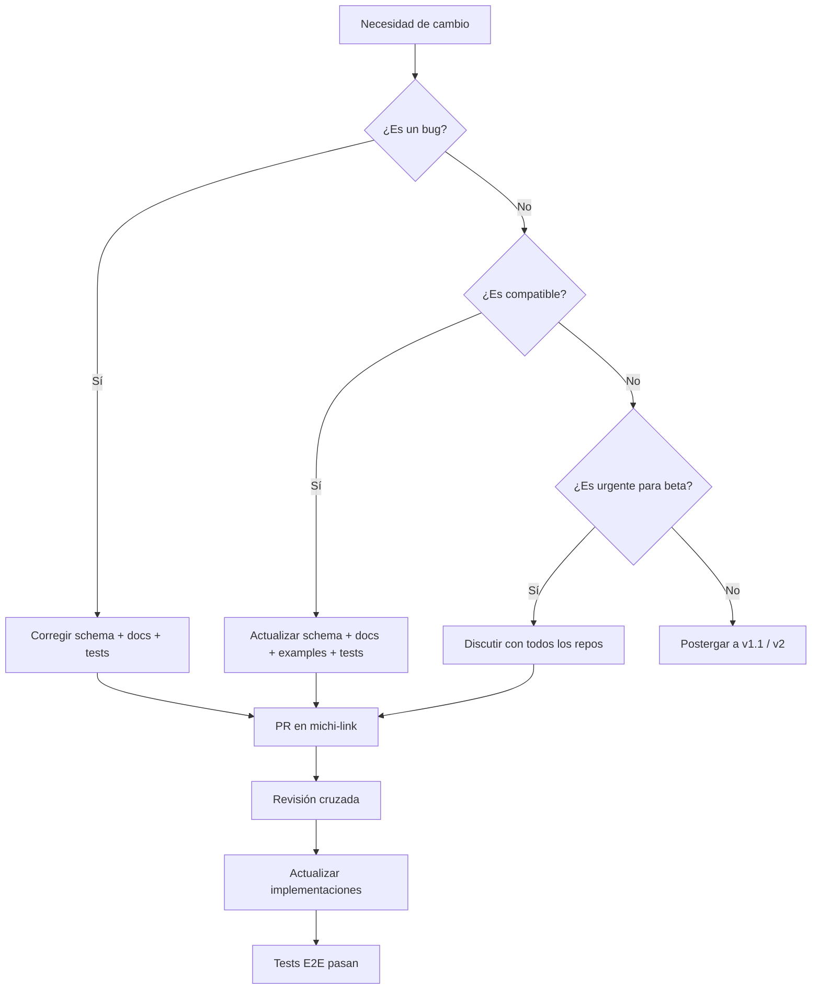

> **HISTORICAL** — kept for reference only; NOT part of the active contract.

# Contract Change Policy — Michi Link API v1.0.0-alpha

> **HISTORICAL NOTE:** This document was consolidated into `docs/CONTRACT_GOVERNANCE.md`, which is now the single governance document for contract changes (single source of truth, change process, backward compatibility, deprecation, evidence requirements). Kept for reference only.

## Propósito

Michi Link es la única fuente oficial del contrato del ecosistema Michi. Ningún repositorio de aplicación puede modificar el contrato unilateralmente. Este documento define las reglas para proponer, revisar e implementar cambios.

---

## Reglas Fundamentales

### Regla 1: Ningún repo puede inventar campos nuevos

Si una aplicación necesita un campo nuevo en una respuesta o request, **no puede agregarlo solo en su código**. Debe:
1. Abrir un issue o PR en `pitydah/michi-link`.
2. Actualizar el schema JSON correspondiente.
3. Actualizar los ejemplos.
4. Actualizar la documentación.
5. Actualizar la matriz de implementación.

### Regla 2: Todo cambio de payload debe modificar 4 artefactos

| Artefacto | Qué actualizar |
|-----------|----------------|
| **Schema** | `schemas/*.schema.json` |
| **Docs** | `docs/*.md` (MICHI_LINK_API_V1.md, más doc específica si aplica) |
| **Examples** | `examples/*.json` (al menos un ejemplo válido) |
| **Tests** | `tests/contract/validate.js` (test positivo + negativo si es breaking) |

### Regla 3: Cambios incompatibles se guardan para v1.1 o v2

Durante v1.0.0-alpha y v1.0.x:
- No se eliminan campos existentes.
- No se cambia el tipo de un campo existente.
- No se agregan nuevos `required` a schemas existentes (excepto por corrección de bug).
- Los campos legacy (`action`, `value`, `since`, `manifest_id`) se mantienen aceptados.

Los cambios incompatibles se acumulan para la siguiente versión mayor.

### Regla 4: v1.0.0-alpha prioriza estabilidad

Durante la fase alpha → beta:
- Solo se aceptan correcciones que alineen el contrato con implementaciones reales.
- No se agregan nuevos endpoints.
- No se cambian nombres de campos oficiales.
- No se introducen nuevas estrategias de auth sin discusión en los 4 repos.

---

## Proceso de Cambio

## Tipos de Cambio

### Bugfix (v1.0.x)

- Corrección de schema que no coincide con la implementación real.
- Corrección de ejemplo inválido.
- Corrección de documentación ambigua.

**Ejemplo:** El schema dice `service` enum `michi-player` pero la implementación usa `michi-music-player`. Se corrige el schema.

### Compatible (v1.0.x)

- Nuevo campo opcional en schema.
- Nuevo código de error.
- Nuevo valor en enum existente.
- Aclaración en documentación.

**Ejemplo:** Agregar código de error `RATE_LIMITED` al schema.

### Incompatible (v1.1 / v2)

- Eliminar campo del schema.
- Cambiar tipo de campo existente.
- Hacer required un campo que antes era opcional.
- Eliminar endpoint.
- Cambiar estructura de respuesta.

**Ejemplo:** Eliminar `action` como campo aceptado (reemplazado por `command`).

---

## Responsabilidades por Repositorio

| Repositorio | Responsabilidad |
|-------------|-----------------|
| `michi-link` | Definir y mantener el contrato. Validar cambios. |
| `michi-music-player` | Implementar el contrato como servidor. Reportar desviaciones. |
| `michi-micro-server` | Implementar el contrato como servidor. Reportar desviaciones. |
| `michi-music-mobile` | Implementar el contrato como cliente. Detectar estrategias. |
| `michi-music-stream` | Implementar v1-lite. Reportar limitaciones de hardware. |

---

## Versionado

| Versión | Estado | Cambios permitidos |
|---------|--------|--------------------|
| 1.0.0-alpha | Desarrollo activo | Bugfixes + cambios compatibles |
| 1.0.0-beta | Congelado para pruebas | Solo bugfixes críticos |
| 1.0.0 | Lanzamiento | Solo bugfixes de seguridad |
| 1.1.0 | Siguiente versión | Features nuevas + cambios compatibles |
| 2.0.0 | Futuro | Cambios incompatibles acumulados |

---

## Firmas

Este documento es vinculante para todos los repositorios del ecosistema Michi.
