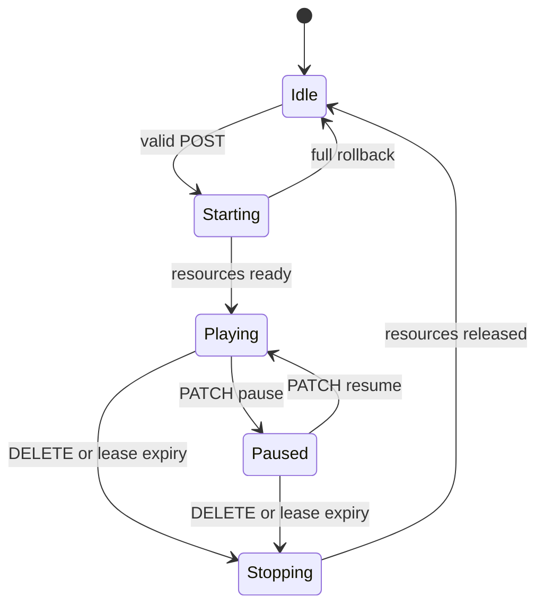

# ADR-0001: Freeze the Receiver v1-lite interoperability decisions

- **Status:** Accepted
- **Date:** 2026-08-12
- **Applies to:** the `v1-lite` receiver profile (`michi-stream-standard`, `michi-stream-hifi`)
- **Consumer:** Michi Music Stream

## Decision

Michi Link is the **normative source** of the receiver v1-lite contract, and the decisions below are frozen. A client must be able to drive a v1-lite receiver using exclusively the contract published by Michi Link — no adapters, no aliases, no receiver-local schemas.

| Area | Frozen decision |
|-------|-----------------|
| Contract authority | Michi Link defines the OpenAPI, JSON Schemas, examples and vectors. The tagged Michi Link contract bundle is the only contractual input for Stream. If OpenAPI, schema, example and documentation disagree, the work is not done. |
| Identity | Persistent Ed25519 identity compatible with Michi Link. `michi_id` derives from `public_key` and is never equal to `server_id`. |
| Discovery | mDNS `_michi-link._tcp.local` plus a signed UDP multicast announce on `224.0.0.167:53318`. |
| Pairing | `RECEIVER_BUTTON` initiated only during a physical 120-second window. Pairing tokens are issued by the receiver. |
| Session | Exactly one active RTP/UDP PCM session per receiver. |
| Control | Status, pause, volume, heartbeat and close, all through the canonical session endpoint. |
| Extensions | `now-playing`, diagnostics and OTA are optional and announced through feature flags. |
| Library | None — see [Not supported](#not-supported). |

## Context

Michi Music Stream must become a v1-lite audio receiver that a Michi Link client can drive with a single, shared contract. The receiver hardware is constrained: it converts PCM audio to physical output and holds no library state. This ADR freezes the interoperability profile (routes, info shape, discovery, pairing, auth, session lifecycle and errors) so Stream can implement it without guessing, and freezes the scope boundaries so nobody silently reintroduces a parallel legacy API.

## Canonical route table (frozen)

All routes start with `/api/v1`. All JSON bodies use `snake_case`, UTF-8 and `Content-Type: application/json`. Except for `204` responses, every error uses the canonical `Error` schema.

| Method | Route | Success | Auth | Feature |
|--------|-------|--------:|------|---------|
| `GET` | `/api/v1/server/info` | `200` | none | always |
| `POST` | `/api/v1/pair/start` | `201` | none; physical window open | always |
| `GET` | `/api/v1/pair/status` | `200` | none; `session_id` query | always |
| `POST` | `/api/v1/pair/confirm` | `200` | none; pairing session | always |
| `POST` | `/api/v1/receiver-lite/session` | `201` | Bearer | `session` |
| `GET` | `/api/v1/receiver-lite/session` | `200` | Bearer | `session` |
| `PATCH` | `/api/v1/receiver-lite/session` | `200` | Bearer + session | `session` |
| `DELETE` | `/api/v1/receiver-lite/session` | `204` | Bearer + session | `session` |
| `POST` | `/api/v1/receiver-lite/heartbeat` | `200` | Bearer + session | `heartbeat` |
| `PUT` | `/api/v1/receiver-lite/now-playing` | `204` | Bearer + session | `now_playing` optional |
| `GET` | `/api/v1/receiver-lite/diagnostics` | `200` | Bearer | `diagnostics` optional |
| `GET` | `/api/v1/receiver-lite/firmware` | `200` | Bearer | `ota` optional |
| `POST` | `/api/v1/receiver-lite/firmware` | `202` | Bearer + OTA permission | `ota` optional |

## Receiver info

`GET /api/v1/server/info` returns exactly this shape for Standard; Hi-Fi differs only in `service` (`michi-stream-hifi`) until further certification exists:

```json
{
  "service": "michi-stream-standard",
  "name": "Michi Stream Cocina",
  "server_id": "550e8400-e29b-41d4-a716-446655440000",
  "version": "0.3.0",
  "api_version": "v1-lite",
  "roles": ["audio_receiver"],
  "identity_scheme": "ed25519-blake3-v1",
  "michi_id": "QlGQosQszLQse057MCaw32IAHXv-I5klmAAsbivIays",
  "public_key": "KJN5aOu4gWhA0clmvmwqprYcwYI013vDNPx1jf90CpQ",
  "auth": {
    "required": true,
    "strategy": "RECEIVER_BUTTON",
    "token_refresh": false
  },
  "features": {
    "session": true,
    "heartbeat": true,
    "volume": true,
    "now_playing": true,
    "diagnostics": true,
    "ota": true
  },
  "audio": {
    "transports": ["rtp_udp"],
    "codecs": ["pcm_s16le"],
    "sample_rates": [48000],
    "bit_depths": [16],
    "channels": [2],
    "packet_ms": [10],
    "payload_types": [97],
    "buffer_ms_min": 50,
    "buffer_ms_max": 500
  }
}
```

Rules (frozen):

- `server_id` is a stable UUID v4 generated once and persisted in NVS.
- `michi_id` derives from the public key (michi-identity); it is not equal to `server_id`.
- The three identity fields are mandatory for `michi-stream-*`.
- `roles` contains exactly one element: `audio_receiver`.
- `service` can only be `michi-stream-standard` or `michi-stream-hifi`.
- `version` is the firmware version. No `firmware_version` or `michi_link_version` fields. <!-- michi-policy:exclude -->
- A feature is `true` only when its handler is registered and has a positive test.
- `audio` declares reproducible capability, not the DAC's theoretical capability.
- Reject additional properties in the schema.

## Discovery

Frozen in [docs/DISCOVERY.md](../DISCOVERY.md) together with the general discovery contract. The receiver v1-lite announce profile:

- mDNS service `_michi-link._tcp.local`, port = real HTTP port, instance name = visible device name.
- Mandatory mDNS TXT keys: `device_id`, `service`, `api_version`, `roles`, `michi_id`. `roles` is serialized as `audio_receiver` (plain string, not JSON).
- Signed UDP multicast announce on `224.0.0.167:53318`, IP TTL `1`, a single compact JSON datagram of at most 1200 bytes, sent at boot, on IP change and every 30 s ± 3 s.
- The signed identity group (`michi_id`, `public_key`, `nonce`, `timestamp_ms`, `signature`) is mandatory for Stream. Canonicalization and signature follow Michi Link's golden vectors; no invented field order or prehash.

## Pairing

Frozen in [docs/PAIRING.md](../PAIRING.md). Receiver-specific decisions:

| Decision | Value |
|----------|-------|
| Physical window | A physical button press opens a 120-second window. Rebooting closes it; reopening replaces the previous window and discards pending pairing sessions. Outside the window, `POST /pair/start` responds `403 FORBIDDEN`. |
| PIN | The receiver generates a cryptographically random 6-digit PIN, shows it locally and never returns it over HTTP. |
| PIN transport | Under the LAN trust model the PIN is sent by the client in `POST /pair/confirm` only. |
| Attempts | Max five failed PIN attempts per session; afterwards `429 RATE_LIMITED` and the session is consumed. |
| Token issuance | The token is generated by the receiver: 32 CSPRNG bytes, base64url without padding, returned exactly once. The receiver persists only the SHA-256 digest of the token. |
| Token lifetime | `expires_in: 0` — no automatic expiry; valid until revocation or factory reset. |
| Single use | The session is consumed after success; a second confirm responds `409 CONFLICT`. |
| Controller record | Stores `device_id`, `michi_id`, `public_key`, token digest, permissions, creation date and last activity. The PIN and the plaintext token are never stored. |

## HTTP auth

- Controller header: `Authorization: Bearer <pairing_token>`.
- Mutations of an active session add `X-Michi-Session: <session_token>`.
- `session_token` differs from the pairing token: 32 random bytes, base64url without padding, RAM-only.
- `GET /server/info` and pairing do not use Bearer. `GET /receiver-lite/session` requires Bearer but not `X-Michi-Session`. `PATCH`, `DELETE`, heartbeat and now-playing require both headers.
- Tokens are never accepted in query strings or JSON bodies. Digests are compared in constant time.
- Minimum permissions after pairing: `receiver.status`, `receiver.session`, `receiver.volume`, `receiver.now_playing`. `receiver.ota` is not granted by default.

## Audio session

One session per receiver, frozen in [docs/RECEIVERS_V1_LITE.md](../RECEIVERS_V1_LITE.md):

- `POST /receiver-lite/session` accepts exactly `rtp_udp` / `pcm_s16le` / 48 kHz / 16-bit / stereo / 10 ms packets / payload type 97, `buffer_ms` 50..500, unsigned `ssrc` 1..4294967295 and `volume` 0..100. All fields mandatory, `additionalProperties: false`; invalid values are rejected, never rounded.
- The receiver picks a free UDP port in 49152..65535. The RTP source IP is fixed to the TCP IP of the HTTP request.
- Accepted RTP: v2, no CSRC, no extension, no padding; payload type 97; exact negotiated SSRC (no first-packet-wins); exact inferred source IPv4; PCM little-endian interleaved L/R. A 10 ms packet carries 480 frames, 960 samples, 1920 payload bytes. Packets with wrong source, PT, SSRC or size are rejected and counted. Sequence wrap is handled without closing the session.
- Internal state moves `idle → starting → playing`; partial failure releases socket/buffer/engine and returns to `idle` — no ghost sessions.

## Heartbeat and lease

- `POST /receiver-lite/heartbeat` every 10 seconds with `session_id`, strictly increasing `sequence` and informative `sent_at_ms`.
- A valid heartbeat renews the lease to 30 seconds. Repeated or older heartbeats respond `409 CONFLICT` and do not renew.
- The watchdog uses the monotonic clock. At 30 seconds without a valid heartbeat the receiver runs the same safe close as `DELETE`, increments `lease_expirations` and returns to `idle` — even if RTP packets keep arriving.

## Errors

Single canonical shape: `{"error": {"code", "message", "request_id", "details"}}`.

| Condition | HTTP | `code` |
|-----------|-----:|--------|
| Invalid JSON/field/value | `400` | `INVALID_REQUEST` |
| Missing/invalid Bearer or session token | `401` | `UNAUTHORIZED` |
| Valid token without permission, or physical window closed | `403` | `FORBIDDEN` |
| Missing session/resource | `404` | `NOT_FOUND` |
| Incompatible state, replay or duplicate session | `409` | `CONFLICT` |
| Too many attempts/requests | `429` | `RATE_LIMITED` |
| Feature not implemented | `501` | `NOT_IMPLEMENTED` |
| Unexpected error | `500` | `INTERNAL_ERROR` |

Clients branch on `code` and HTTP status only; `message` is for humans. No local lowercase codes.

## Stream implementation invariants

- NVS persists only: `server_id`, Ed25519 seed/key, device name, and paired controllers (token digest, permissions, metadata). PIN, pairing session, session token, RTP IP/port, heartbeat sequence and playing state are never persisted. Missing identity on first boot is created; corrupt identity requires factory reset and is never silently regenerated.
- `michi_session` is the single owner of the session. HTTP does not duplicate state; audio does not decide authentication.



- Standard and Hi-Fi initially announce the same certified audio. A new capability requires schema, vectors, engine, host/simulator tests and physical evidence.

## Not supported

The following are out of scope for this convergence and must not be reintroduced by any implementation:

**Legacy receiver routes**

- `/api/v1/receiver/info`
- `/api/v1/receiver/session/start`
- `/api/v1/receiver/session/stop`
- `/api/v1/receiver/pair/*`
- `/api/v1/receiver-lite/volume` (replaced by `PATCH /receiver-lite/session`)
- `/api/v1/receiver-lite/info` and `/api/v1/receiver-lite/config`

**Music library**

- Playlists, library browsing, search, `track_id`, song download
- Autonomous playback from URL or local storage

**Codecs and transports**

- Opus, FLAC, MP3, PCM 24-bit (`pcm_s24le`), 96 kHz
- AirPlay, Spotify Connect, Bluetooth, HDMI, optical

**System**

- Multiroom, clock sync, RTCP, drift compensation
- TLS, PAKE, Secure Boot or Flash Encryption before the production packages
- More than one active session
- A parallel legacy API
- Visual refactor, UI change or new UI framework

## Consequences

- [docs/RECEIVERS_V1_LITE.md](../RECEIVERS_V1_LITE.md), [docs/PAIRING.md](../PAIRING.md), [docs/DISCOVERY.md](../DISCOVERY.md) and [docs/AUTH_PROFILES.md](../AUTH_PROFILES.md) are updated to match this ADR.
- The frozen decisions drive the contract work that follows: canonical JSON Schemas, OpenAPI surface, tagged conformance bundle, and the alpha.1 tag. Stream consumes the tagged bundle only.
- Any later change to this profile requires a new ADR or a superseding decision; implementations must not reinterpret the frozen contract.
